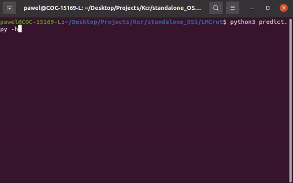
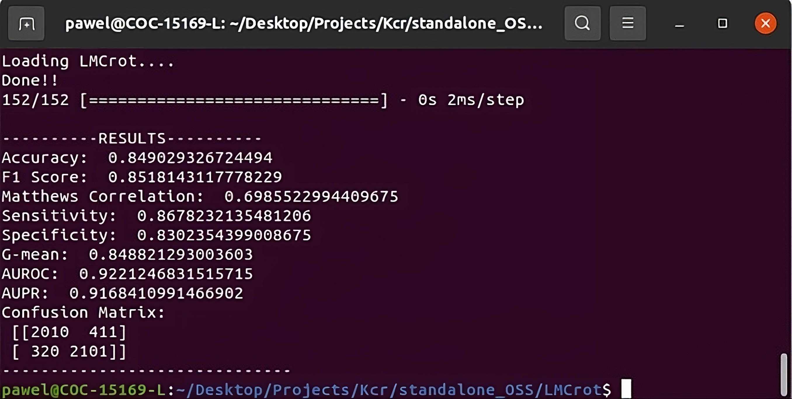
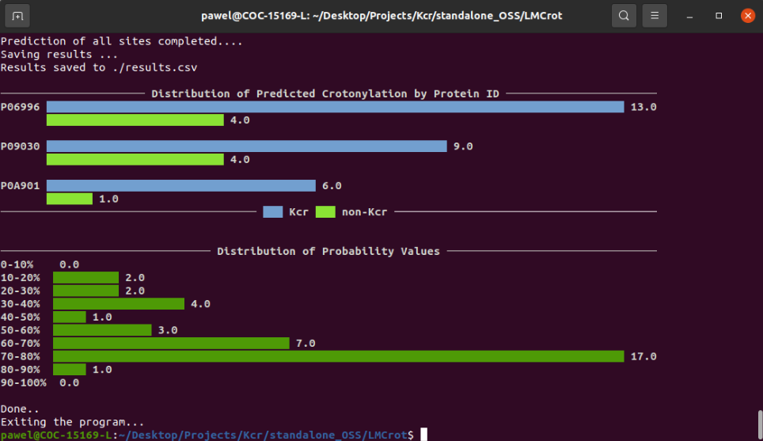

<div align="center">

# <span style="color:blue;">LMCrot</span> [](https://twitter.com/intent/tweet?text=Check%20out%20this%20amazing%20repository&url=https://github.com/KCLabMTU/pLMSNOSite&via=YourTwitterHandle&hashtags=github,transformers,ptmprediction,proteins)

</div>


 <p align="center">
Predict Crotonylation (Kcr) Modification in Proteins Using Transformer-based Protein Language Model and Residual Network 
 </p>
 
---
<p align="center">
<!---
 
-->
 
</p>

<p align="center">
<a href="https://www.python.org/"></a>
<a href="https://www.tensorflow.org/"></a>
<a href="https://keras.io/"></a>
<a href="https://huggingface.co/transformers/"></a>
<a href="https://pytorch.org/"></a>
<a href="https://biopython.org/"></a>
<a href="https://scikit-learn.org/"></a>
<a href="https://matplotlib.org/"></a>
<a href="https://numpy.org/"></a>
<a href="https://pandas.pydata.org/"></a>
<a href="https://seaborn.pydata.org/"></a>
<a href="https://tqdm.github.io/"></a>
<a href="https://github.com/KCLabMTU/LMCrot/commits/main"></a>
<a href="https://github.com/KCLabMTU/LMCrot/blob/main/LICENSE"></a>
<a href="https://github.com/KCLabMTU/LMCrot/pulls"></a>


 
</p>

##  About
LMCrot is a robust predictor of crotonylation (Kcr) modification sites in protein sequences. It employs an intermediate-fusion-based stacked generalization approach to harness the representational power of global contextual embeddings obtained from a transformer protein language model called [`ProtT5-XL-UniRef50`](https://github.com/agemagician/ProtTrans) combined with local contextual embeddings from the supervised word embedding layer and amino acid properties.

#### About ProtT5-XL-UniRef50
[`ProtT5-XL-UniRef50`](https://github.com/agemagician/ProtTrans) is a transformer-based protein language model that was developed by Rostlab. This model uses Google's T5 (Text-to-Text Transfer Transformer) architecture. Using the Masked Language Modelling (MLM) objective, ProtT5 was trained on the UniRef50 dataset (consisting of 45 million protein sequences) in a self-supervised fashion. This comprehensive training allows the model to effectively capture and understand the context within protein sequences, proving valuable for tasks like predicting PTM sites. More details about ProtT5 are as follows:
| Dataset | No. of Layers | Hidden Layer Size | Intermediate Size | No. of Heads | Dropout | Target Length | Masking Probability | Local Batch Size | Global Batch Size | Optimizer | Learning Rate | Weight Decay | Training Steps | Warm-up Steps | Mixed Precision | No. of Parameters | System | No. of Nodes | No. of GPUs/TPUs |
|---------|---------------|-------------------|-------------------|--------------|---------|---------------|---------------------|------------------|-------------------|-----------|---------------|--------------|----------------|---------------|-----------------|------------------|--------|--------------|-----------------|
| UniRef50 | 24 | 1024 | 65536 | 16 | 0.1 | 512 | 15% | 84 | 4096 | AdaFactor | 0.01 | 0.0 | 400K/400K | 40K/40K | None | 3B | TPU Pod | 32 | 1024 |

Note: Info. in the table adopted from "ProtTrans: Towards Cracking the Language of Life’s Code Through Self-Supervised Learning," by A. Elnaggar et al., 2023, *IEEE Transactions on Pattern Analysis & Machine Intelligence*, 14(8).

## Webserver  :globe_with_meridians:

You can access the webserver of LMCrot at [`kcdukkalab.org/Lmcrot/`](http://kcdukkalab.org/Lmcrot/).

## Build Environment 💻
The tool was developed in the following computing environment, ensuring robust and efficient functionality:
- **RAM:** 384 GB
- **Processor:** Intel Xeon(R) Silver 4216 CPU @ 2.10 GHz (32 cores)
- **GPU:** NVIDIA Tesla A100 Ampere 40 GB HBM2 (6912 CUDA cores & 432 Tensor cores)
- **Storage:** 2TB SK hynix PC711 NVMe SSD
- **Operating System:** Ubuntu 20.04.6 LTS (64-bit)

## Getting Started  :rocket: 

To get a local copy of the repository, you can either clone it or download it directly from GitHub.

### Clone the Repository

If you have Git installed on your system, you can clone the repository by running the following command in your terminal:

```shell
git clone git@github.com:KCLabMTU/LMCrot.git
```
### Download the Repository
Alternatively, if you don't have Git or prefer not to use it, you can download the repository directly from GitHub. Click [here](https://github.com/KCLabMTU/LMCrot/archive/refs/heads/main.zip) to download the repository as a zip file.

> <kbd>**Note:**</kbd>
> In the 'Download the Repository' section, the link provided is a direct download link to the repository's `main` branch as a zip file. This may differ if your repository's default branch is named differently.

## Install Libraries

Python version: `3.9.7`

To install the required libraries, run the following command:

```shell
pip install -r requirements.txt
```

Required libraries and versions: 
<code>
python==3.8.10
numpy==1.23.5
pandas==1.5.3
seaborn==0.12.2
tqdm==4.65.0
pyfiglet==0.8.post1
matplotlib==3.7.1
scikit-learn==1.3.0
Bio==1.81
tensorflow==2.12.0
keras==2.12.0
torch==1.11.0
transformers==4.20.1
propy3==1.1.1
plotext==5.2.8
</code>

### Install Transformers
```shell
pip install -q SentencePiece transformers
```
## Evaluate LMCrot on Independent Test Set

To evaluate the LMCrot model on the independent test set, we've made the necessary data available for download. You can access it using the following link:

[Download the Independent Data](https://drive.google.com/drive/folders/1cp6UHSoN5vOLp1XkZOlmgklA5WUhpFIj)

Once you have downloaded the data, place all the data files under a folder named `independent_data` in the same directory as the evaluation script.

After ensuring that all the requirements are installed, you can evaluate the model by running the command below:
```shell
python3 evaluate_model.py
```
**CLI output:**
 <p align="center">
<!---
-->
 
</p>

## Predict crotonylation-modified sites in your own sequence

### Setup:

1. Place your FASTA file in the `input/sequence.fasta` directory.

### Command:

2. Use the following command to make predictions:

   ```shell
   python3 predict.py --device [DEVICE] --mode [MODE]
   ```
   or in short form notation,
    ```shell
   python3 predict.py -d [DEVICE] -m [MODE]
     ```
   **Replace:**
- `[DEVICE]` with the device for the transformer model (ProtT5-U50-XL) to run on. Choices: `CPU` or `GPU`. (Default: `CPU`)
- `[MODE]` with the precision mode for computations of ProtT5. Default is `full-precision`. If `half-precision` is given, the embeddings will be generated in half-precision model. If any other value is given, `full-precision` will be used for embedding generation.

    Example:
     ```shell
     python3 predict.py -d CPU -m full-precision
     ```
     
### Running with Default Parameters:

If you want to run the program with default parameters, then use the following hassle-free command:

```shell
python3 predict.py
```

### Results:
- You can find the results as a csv file named `results.csv` in the current directory.

The CLI will also display the following distribution graphs towards the end: 
 <p align="center">
<!---
-->
 
</p>

> <kbd>**Note:**</kbd>
> 1. You can always use the `-h` or `--help` flag to get detailed information about available command-line arguments.
> 2. Alternatively, you can also use the aforementioned web server version (see the previous section) for prediction.

## General Notes  :memo: 
1. The prediction runtime directly depends on the length of the input sequence. Longer sequences require more time for ProtT5 to generate feature vectors, and consequently, more time is needed for prediction.
2. In order to tailor the system to your specific requirements, we have ensured that modifying the decision threshold cut-off value is simple and straightforward. Here's what you need to do:
   - Open the `predict.py` file 
     - Navigate to line `281`
     - You'll find the current cut-off value is set at `0.5`
     - Adjust this to any preferred cut-off value
       
   By following these simple steps, you can easily customize the decision threshold cut-off value to better meet the needs of your project.
3. Please note that the index is `zero-based`. For instance, a site position at `45` will be recognized as `44` by the program.
4. With a window size of `31`, the site-of-interest ('K' in this case) will be positioned at the `15th` index (keeping in mind the index starts from `0`).

## Funding
<p>
  <a href="https://www.nsf.gov/">
    
  </a>
 National Science Foundation (NSF)
</p>

**Grant Numbers:** *1901793*, *2210356*

## Contact  :mailbox: 
Should you have any inquiries related to this project, please feel free to reach out via email. Kindly CC all of the following recipients in your communication for a swift response:

- Main Contact: [dbkc@mtu.edu](mailto:dbkc@mtu.edu)
- CC: [ppratyush@mtu.edu](mailto:ppratyush@mtu.edu)

We look forward to addressing your queries and concerns.
